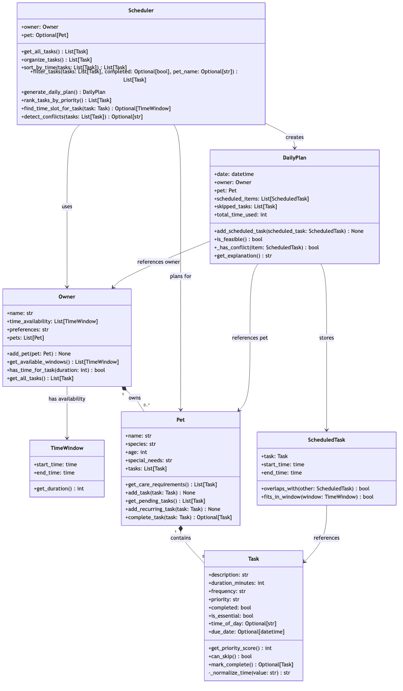

# PawPal+ (Module 2 Project)

You are building **PawPal+**, a Streamlit app that helps a pet owner plan care tasks for their pet.

## Scenario

A busy pet owner needs help staying consistent with pet care. They want an assistant that can:

- Track pet care tasks (walks, feeding, meds, enrichment, grooming, etc.)
- Consider constraints (time available, priority, owner preferences)
- Produce a daily plan and explain why it chose that plan

Your job is to design the system first (UML), then implement the logic in Python, then connect it to the Streamlit UI.

## What you will build

Your final app should:

- Let a user enter basic owner + pet info
- Let a user add/edit tasks (duration + priority at minimum)
- Generate a daily schedule/plan based on constraints and priorities
- Display the plan clearly (and ideally explain the reasoning)
- Include tests for the most important scheduling behaviors

## Getting started

### Setup

```bash
python -m venv .venv
source .venv/bin/activate  # Windows: .venv\Scripts\activate
pip install -r requirements.txt
```

### Suggested workflow

1. Read the scenario carefully and identify requirements and edge cases.
2. Draft a UML diagram (classes, attributes, methods, relationships).
3. Convert UML into Python class stubs (no logic yet).
4. Implement scheduling logic in small increments.
5. Add tests to verify key behaviors.
6. Connect your logic to the Streamlit UI in `app.py`.
7. Refine UML so it matches what you actually built.

## 🖥️ Sample Output

Verified by running the demo script in the terminal:

```text
Today's Schedule
====================
- 08:00 - 08:30 : Morning walk (30 min)
- 08:30 - 08:40 : Feeding (10 min)
- 08:40 - 09:00 : Grooming (20 min)
- 09:00 - 09:15 : Play time (15 min)
```

## 🧪 Testing PawPal+

Run the full test suite with:

```bash
python -m pytest
```

These tests check the core scheduling behavior of PawPal+, including:

- task sorting and ordering
- recurring task behavior for daily and weekly care items
- conflict detection for overlapping task times
- basic pet and owner task management

Example test run:

```text
============================= test session starts ==============================
platform darwin -- Python 3.13.0, pytest-7.4.1, pluggy-1.0
rootdir: /Users/qiuzifeng/Desktop/CodePath 2026/ai110-module2show-pawpal-starter
collected 12 items

tests/test_pawpal.py::test_mark_complete_changes_task_status PASSED
tests/test_pawpal.py::test_adding_task_increases_pet_task_count PASSED
tests/test_pawpal_system.py::test_task_can_be_marked_complete PASSED
tests/test_pawpal_system.py::test_pet_tracks_and_filters_tasks PASSED
tests/test_pawpal_system.py::test_owner_collects_tasks_from_all_pets PASSED
tests/test_pawpal_system.py::test_scheduler_organizes_pending_tasks_across_pets PASSED
tests/test_pawpal_system.py::test_scheduler_can_sort_tasks_by_time_of_day PASSED
tests/test_pawpal_system.py::test_scheduler_can_filter_tasks_by_completion_and_pet_name PASSED
tests/test_pawpal_system.py::test_mark_complete_creates_next_occurrence_for_daily_task PASSED
tests/test_pawpal_system.py::test_pet_tracks_next_occurrence_when_recurring_task_is_completed PASSED
tests/test_pawpal_system.py::test_scheduler_reports_conflict_warning_for_overlapping_tasks PASSED
tests/test_pawpal_system.py::test_sort_by_time_returns_tasks_in_chronological_order PASSED
tests/test_pawpal_system.py::test_mark_complete_creates_a_new_task_for_the_following_day PASSED
tests/test_pawpal_system.py::test_scheduler_flags_duplicate_times_as_conflicts PASSED

============================== 12 passed in 0.02s ==============================
```

Confidence Level: ★★★★★

The scheduler logic is currently well covered for its core behaviors, and the passing test run gives strong confidence in the reliability of the planning and recurrence features.

## 📐 System Architecture

The final UML diagram for PawPal+ is saved in [diagrams/uml_final.mmd](diagrams/uml_final.mmd) and rendered below.



## ✨ Features

PawPal+ combines a small scheduling engine with a simple Streamlit interface so a pet owner can quickly organize daily care.

- Sorting by time: `Scheduler.sort_by_time()` orders tasks chronologically so the schedule is easy to follow.
- Priority-based planning: `Scheduler.organize_tasks()` ranks tasks by importance, duration, and planned time.
- Conflict warnings: `Scheduler.detect_conflicts()` highlights overlapping appointments before they become a problem.
- Recurring tasks: `Task.mark_complete()` and `Pet.complete_task()` create the next daily or weekly occurrence automatically.
- Pet-specific filtering: the UI lets users view appointments for one pet or for all pets at once.
- Beginner-friendly dashboard: `app.py` presents metrics, a bar chart, and a clean schedule table for fast review.

## 📸 Demo Walkthrough

Follow this quick workflow to see the scheduler in action:

1. Start the app with `streamlit run app.py`.
2. Enter the owner and pet information, then add a pet to the owner profile.
3. Add one or more appointments such as walks, feeding, grooming, or vet visits.
4. Review the scheduler overview to see sorted upcoming tasks, pet-specific filtering, and any conflict warnings.
5. Run `python3 main.py` to see the same scheduling logic in the terminal, including sorted tasks, pending items, and recurring-task behavior.

A typical example workflow looks like this:

- Add a pet such as Mochi
- Add care tasks with times and durations
- View the sorted schedule in the UI
- Confirm whether any conflicts need attention before finalizing the day

Sample CLI output from running `main.py`:

```text
Today's Schedule
====================
- 08:00 - 08:30 : Morning walk (30 min)
- 08:30 - 08:40 : Feeding (10 min)
- 08:40 - 08:50 : Brush (10 min)
- 08:50 - 09:05 : Brush (15 min)
- 09:05 - 09:25 : Grooming (20 min)
- 09:25 - 09:40 : Play time (15 min)

Sorted tasks by time:
- 08:00 : Feeding
- 09:15 : Grooming
- 09:15 : Brush
- 10:30 : Morning walk

Pending tasks for Mochi:
- Feeding
- Grooming
- Brush
- Morning walk

Warning: conflict detected for Mochi between Brush and another task at the same time.

Next recurring task created: Morning walk due 2026-07-08 23:55:58.799605
```
